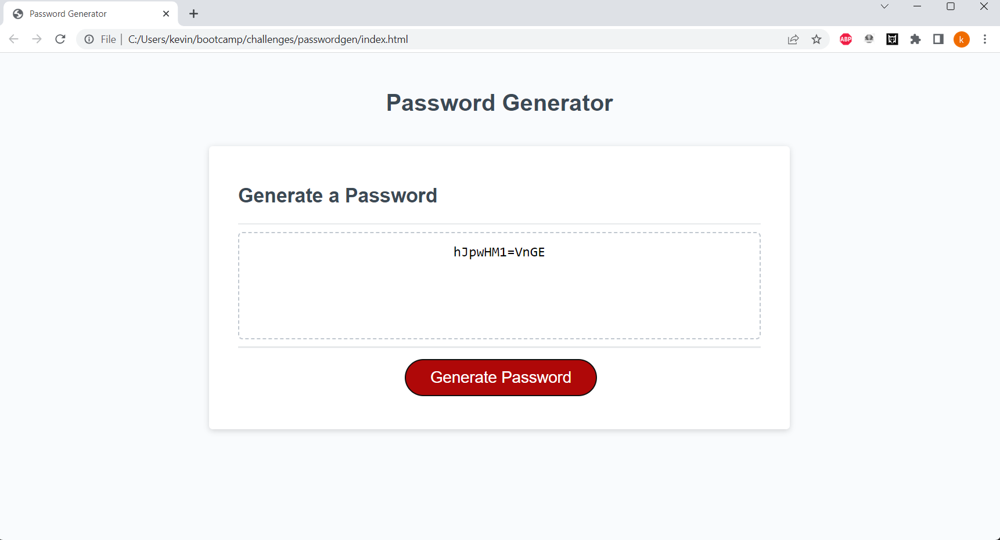

# passwordgen
## Description
### I desisgned a password generator using javascript. When you click on the button a prompt appears asking for a length between 8-128. After 4 confims appear asking for different critera. Assuming at least one is picked i used two math() fucntions to generate a password to the users lenghth.
## links
###
[Website]https://kdonnelly33.github.io/passwordgen/
[Repository]https://github.com/KDonnelly33/passwordgen
## Screenshot
